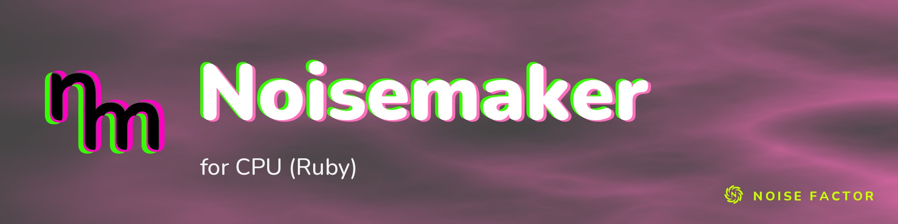

<!-- repo-hero -->
<a href="https://noisemaker.app/"></a>

<sub>Open source from <a href="https://noisefactor.io">Noise Factor</a> &middot; <a href="https://github.com/noisefactorllc">more projects</a></sub>

# noisemaker-for-ruby

> This package supports the "Export Shader Pipeline" feature in Noisedeck.app. The feature runs shader compositions on other platforms. Noise Factor derives this package from the upstream Noisemaker Engine project and tests it for pixel-level parity.

This is not a classic noise library. This is a new effort centered around
software shader execution.

A pure-Ruby CPU implementation of the [Noisemaker](https://noisemaker.app)
shader engine — the Ruby port of [`noisemaker-for-cpu`](https://github.com/noisefactorllc/noisemaker-for-cpu),
sibling to the [Python](https://github.com/noisefactorllc/noisemaker-for-python)
and [Perl](https://github.com/noisefactorllc/noisemaker-for-perl) ports.

Effect kernels are **transpiled directly from the upstream GLSL** served by the `shaders.noisedeck.app` CDN (sha256-locked). They are not hand-maintained. A pure-Ruby GLSL ES 3.00 front end lexes, preprocesses, parses, and emits a Ruby kernel per shader pass. A float32-faithful runtime reproduces the reference engine's arithmetic:

- Float32 register rounding.
- Half-float render-target quantization.
- GLSL uint32 wraparound with bit-exact PCG hashing.
- Screen-space derivatives.
- GL texture sampling.

The bundle includes **all 205 catalog effects** (289 kernels). They render at **byte-parity** with the JavaScript engine's `effect` CLI. `scripts/parity.rb` verifies this against a sibling `noisemaker-for-cpu` checkout.

## Install

Core stdlib only — no runtime gem dependencies. Ruby 3.2+.

```bash
gem build noisemaker-for-ruby.gemspec
gem install noisemaker-for-ruby-0.0.0.gem
```

Or straight from a checkout: `ruby -Ilib exe/noisemaker-rb ...`

## Render an effect

CLI:

```bash
# generate a single frame
noisemaker-rb generate synth/curl --width 512 --height 512 --filename curl.png
noisemaker-rb generate random --seed 42

# apply an effect to an existing image
noisemaker-rb apply filter/chrome photo.png --filename chrome.png

# animate an effect over time (needs ffmpeg for .mp4)
noisemaker-rb animate synth/curl --frame-count 60 --filename curl.mp4

# render a Polymorphic DSL program from stdin
echo 'search synth, filter
noise(seed: 3, ridges: true).vignette().write(o0)
render(o0)' | noisemaker-rb run --width 512 --height 512
```

Library:

```ruby
require "noisemaker_cpu"

surface = NoisemakerCpu::Renderer.render_effect(
  "synth/curl", { "scale" => 16 }, nil, width: 512, height: 512, seed: 1
)
File.binwrite("curl.png", NoisemakerCpu::PNG.encode_png(surface))
```

## Regenerating the bundle

The vendored kernels + metadata under `lib/noisemaker_cpu/bundle/` are
generated from the CDN (cached to `.cdn-cache/`, sha256-locked in
`bundle-lock.json`):

```bash
ruby scripts/build-bundle.rb --all
```

## Tests

```bash
rake test
```

Cross-language parity against the JS engine (`scripts/parity.rb`) needs a
sibling `noisemaker-for-cpu` checkout (or `NOISEMAKER_CPU_DIR`) and Node.
The harness requires exact RGBA8 bytes for all 205 effects and fails on any
difference, render error, or unknown effect selection.

## License

MIT © Noise Factor LLC. See [LICENSE](LICENSE).
